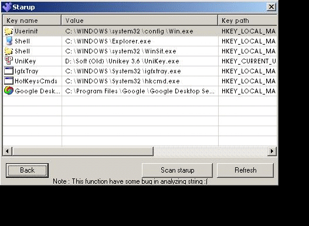



## vnAntivirus

### Description

vnAntivirus

Dung Le Nguyen

dungcoivb@gmail.com

- vnAV can detect rootkit with method detect handle. The method simple but effect.

I was tested with some sample Rootkit and some tool to hidden process.

Yeah, this software can detect it.

- You can easy see programs startup.

- Use signatures ( With MD5 code) to detect virus.With more 800.000 MD5 code

- It can index to fast scan for next time.

- Add sitgnature virus by user : User can add signature virus (Icon or MD5 code). This is function interesting.

- If you manager file in Windows Explorer, my soft can scan every folder you use and detect if in it contain virus.

- If can auto detect have new USB disk and scan it.

More ...

You can download full source at : http://www.mediafire.com/download.php?1oyatdyqyjz

Please vote this code if you like it :)
 
### More Info
 

             |
---                |---
**Submitted On**   |2008-03-21 22:31:34
**By**             |[Dung Nguyen Le](https://github.com/Planet-Source-Code/PSCIndex/blob/master/ByAuthor/dung-nguyen-le.md)
**Level**          |Intermediate
**User Rating**    |4.7 (14 globes from 3 users)
**Compatibility**  |VB 5\.0, VB 6\.0
**Category**       |[Complete Applications](https://github.com/Planet-Source-Code/PSCIndex/blob/master/ByCategory/complete-applications__1-27.md)
**World**          |[Visual Basic](https://github.com/Planet-Source-Code/PSCIndex/blob/master/ByWorld/visual-basic.md)
**Archive File**   |[vnAntiviru2106963222008\.zip](https://github.com/Planet-Source-Code/dung-nguyen-le-vnantivirus__1-70312/archive/master.zip)

### API Declarations

You can see in source :)

